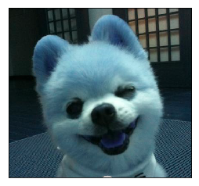
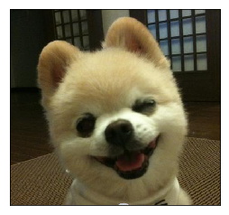

```python
import cv2
```


```python
img=cv2.imread('e:/rotman.jpg')
img
```


    array([[[ 14,  21,  16],
            [ 13,  20,  15],
            [ 12,  19,  14],
            ...,
            [ 22,  40,  41],
            [ 22,  40,  41],
            [ 22,  40,  41]],
    
           [[ 13,  20,  15],
            [ 13,  20,  15],
            [ 12,  19,  14],
            ...,
            [ 21,  39,  40],
            [ 21,  39,  40],
            [ 21,  39,  40]],
    
           [[ 12,  19,  14],
            [ 13,  20,  15],
            [ 13,  20,  15],
            ...,
            [ 22,  37,  39],
            [ 20,  38,  39],
            [ 20,  38,  39]],
    
           ...,
    
           [[ 26,  52,  69],
            [ 32,  58,  75],
            [ 51,  77,  94],
            ...,
            [ 32,  60,  77],
            [ 61,  89, 106],
            [ 68,  96, 113]],
    
           [[ 49,  75,  92],
            [ 44,  70,  87],
            [ 46,  72,  89],
            ...,
            [ 46,  74,  91],
            [ 64,  92, 109],
            [ 61,  89, 106]],
    
           [[ 56,  82,  99],
            [ 42,  68,  85],
            [ 35,  61,  78],
            ...,
            [ 60,  88, 105],
            [ 64,  92, 109],
            [ 49,  77,  94]]], dtype=uint8)


```python
img2=cv2.imread('e:/rotman.jpg',0)
img2
```


    array([[19, 18, 17, ..., 38, 38, 38],
           [18, 18, 17, ..., 37, 37, 37],
           [17, 18, 18, ..., 36, 36, 36],
           ...,
           [54, 60, 79, ..., 62, 91, 98],
           [77, 72, 74, ..., 76, 94, 91],
           [84, 70, 63, ..., 90, 94, 79]], dtype=uint8)


```python
cv2.imshow('image',img)
cv2.waitKey(0)
cv2.destroyAllWindows()
```


```python
cv2.imwrite('e:/copy.png',img)
```


    True


```python
from matplotlib import pyplot as plt
plt.imshow(img)
plt.xticks([]), plt.yticks([])  
plt.show()
```





```python
b,g,r=cv2.split(img)
img3=cv2.merge([r,g,b])
plt.imshow(img3)
plt.xticks([]),plt.yticks([]) # 不显示坐标轴
plt.show()
```




